# Raspberry
### Bluemix and Raspberry Pi
*version 1.1, October 2017*

This documentation is guideline to configure and use this application. 

__*This sample application documentation configuration assumes you have good knowledge of Bluemix service and Raspberry Pi.__

__This is not a training step by step__

This is sample application to demonstrate IoT capability with the use of IBM Bluemix platfrom:
* IoT Platform
* Node-Red
* Db2 Warehouse
* Watson Language Translator
* Watson Text to speech
* API Connect *(in the next version)*
* iPhone application *(Beta version)*


### Prerequisites:

* You must have a [Bluemix account](https://www.bluemix.net).
* You must have a Raspberry Pi and a Sense HAT.
* You must be able to connect to your Raspberry Pi on a network and you need to know it’s ip address.
* You should have an SSH terminal program for connecting to the Raspberry Pi. If you are using a MacOS or Linux system, you are ready. If you are using a Windows system, install the PuTTY application, which is available at http://www.putty.org Software installer.

#### 1. Bluemix Services

##### 1.1 Bluemix IoT
We will create an IoT service to connect the Raspberry Pi to a Node-RED instance.

1. Login in your Bluemix account, go to catalog and create a new IoT service.

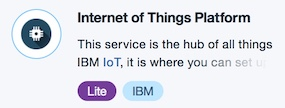

2. In your newly created IoT Platform service, define a new __gateway device__ type called PiGateway.
3. Add a new __gateway device__ using the newly defined PiGateway device type.  Make a note of the following items from the summary page as you will need them later when you actually connect your device to the IoT Platform service: __(Organization ID, Device Type, Device ID, Token)__

#### 2. Raspberry PI
In this sample you will use a Raspberry Pi and a Sense HAT to send data to a Node-Red Bluemix Instance. The Raspberry Pi running Raspbian Operating System. Raspbian include a Node-Red runtime instance. You will use this Node-Red to connect the Raspberry Pi to the Bluemix IoT Platform.
* [Raspbian download](https://www.raspberrypi.org/downloads/raspbian/)


1. Apply power to your Raspberry Pi by attaching a standard microUSB cable between the microUSB
connector on the Raspberry Pi and a power source such as a laptop or USB power block. (booting
takes less than a minute).
2. Connect to your Raspberry Pi using ssh. Your Pi can be reached at via it’s IP address by using the
following format: ssh pi@<ip address>.
_Note: you can also use VNC to connect to your Raspberry PI_
3. The Raspberry Pi credential are:
User ID: pi
Password: raspberry
4. In order to ensure that Node-RED will restart automatically in the event of reboots and crashes, you
should enable the Node-RED service with the command:
sudo systemctl enable nodered.service
5. Finally, start Node-RED on the Pi with the command:
node-red-start
Note: When the Node-RED app starts, the last action it performs is to start a logging function. You
can exit this logging, if needed, by pressing Ctrl-c. This will not stop Node-RED itself. If/When
you want to stop Node-RED, you need to issue the command: node-red-stop.
6. Open a browser and access your Raspberry Nodered interface:
```
http://<raspberry Pi IP Address>:1880/
```

7. Open RaspberryPiFlow.txt form NodeRed Flows of this GitHub
8. Copy the content of the file
9. Go back to your Node-RED and Import the content from the Clipboard 
10. Open the configuration of one IoT node:
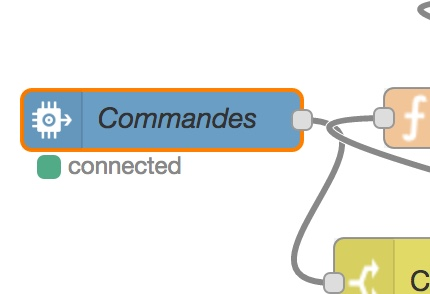
11. Click on the pen to modify the credentials
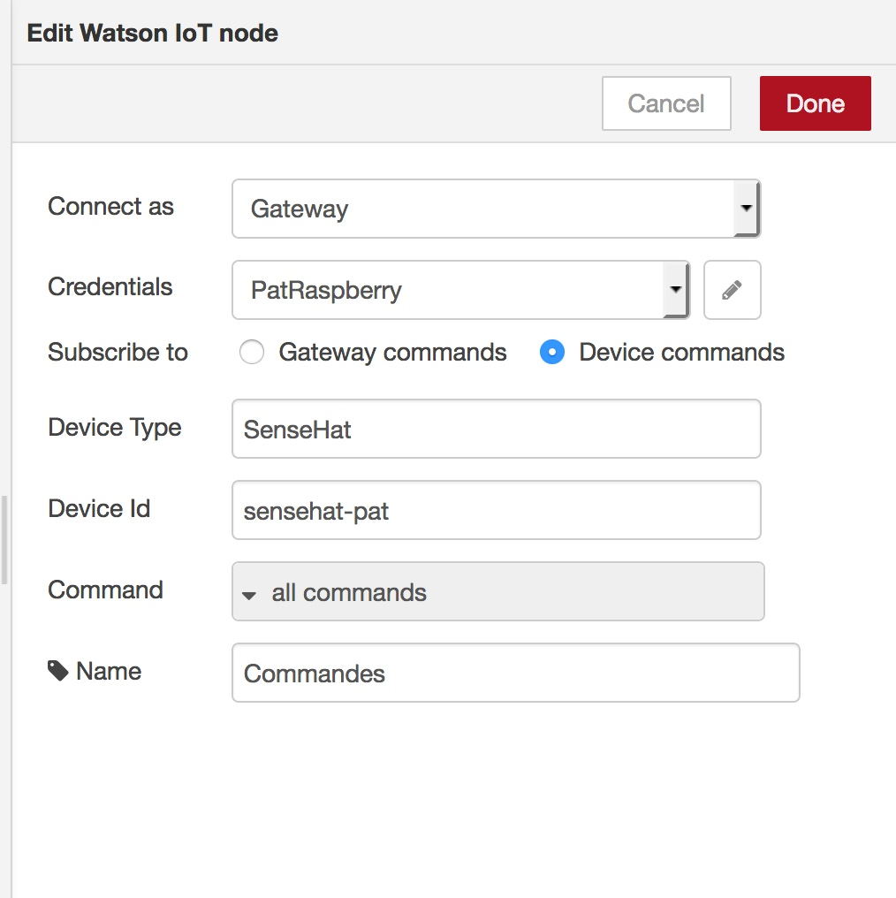
12. Enter all your IoT Gateway information __(Organization ID, Device Type, Device ID, Token)__ and rename the credential to create a new one
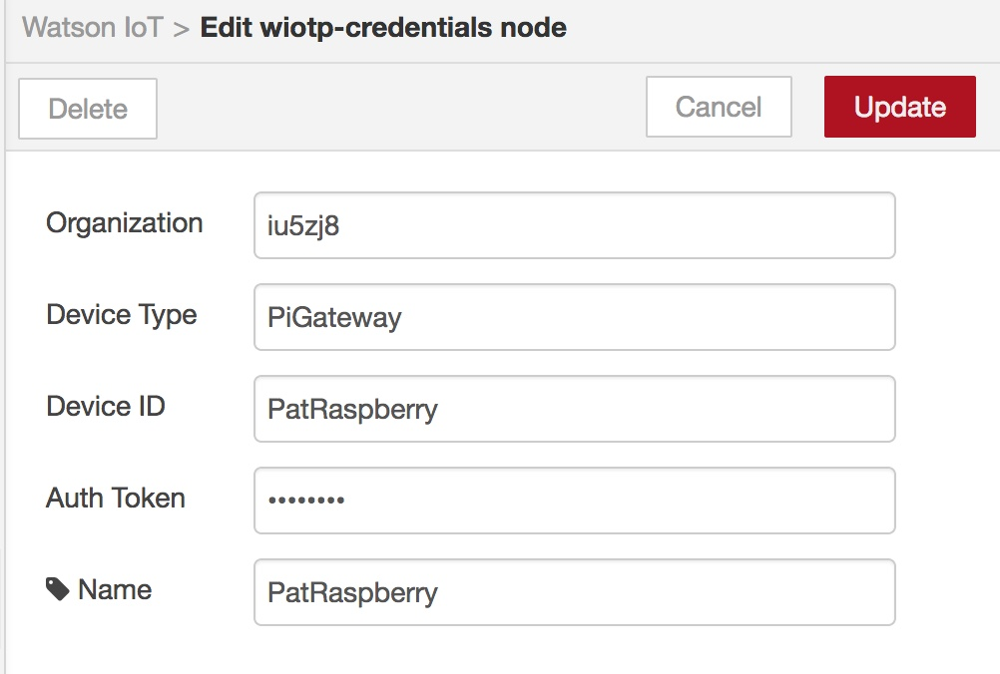
13. Uodate this crendantial and go back to the IoT node configuration

14. Modify the device Id by device name you want. (This will create the senseHat device in your IoT foundation)
15. Modify __all the IoT nodes in all flow__. You will select the new cerdential you created and the new device name your decide.
16. deploy your flow

#### 3. Bluemix Services

##### 3.1 Bluemix Watson Text to Speech
We will create Watson Text to Speech service to be use in the Node-RED instance dashboard.

1. Login in your Bluemix account, go to catalog and create a new Watson Text to Speech service.

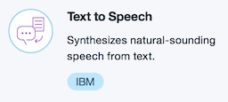

##### 3.2 Bluemix Watson Language Translator
We will create Watson Language Translator service to be use in the Node-RED instance dashboard.

1. Login in your Bluemix account, go to catalog and create a new Watson Language Translator service.

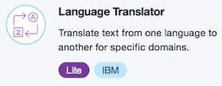

##### 3.3 Bluemix Db2 Warehouse
We will create Watson Db2 Warehouse service to save environment datas.

1. Login in your Bluemix account, go to catalog and create a new Db2 Warehouse service.

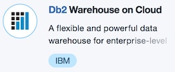

2. To get started, find the  your Db2 service in your Bluemix dashboard and click on it to
launch the service.
3. Like the IoT Platform service, this will land you on the “Service Details” page of your Db2
Warehouse on Cloud service where you should click Open.
Note: The Db2 Warehouse on Cloud service should then launch in a separate browser window or
tab leaving the Service Details tab open as well. Keep this tab open as it will make returning to the
Bluemix dashboard much easier.
4. In order to create a new table from here, you need to select Explore.
5. From there you will be presented a list of database schemas. You should click on the one
beginning with DASH (for example: ) and then click on .
6. Name your new table: SENSEDATA
7. Replace the text in the box with the following. Each line represents one column of the table along
with its type:

```
 SENSORID  VARCHAR(20)
 TEMPERATURE  DOUBLE 
 HUMIDITY  DOUBLE 
 PRESSURE  DOUBLE 
 TIMESENT  TIMESTAMP 
```

Note: The name of this table and the names of the rows will be an important element of later
workshops so be sure to double check your spelling.

##### 3.4 Bluemix Node-Red
###### 3.4.1 creation & configuration


1. Login in your Bluemix account, go to catalog and create a new IoT Starter.

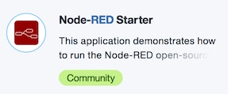

2. On the resulting page, you need to give your application a name. You can name your application anything you like provided it is unique in the Bluemix space. At this point, your application will be created and, after a few moments, you will be taken to the Getting Started page for your application.
3. You now need to create connections to your IoT, Watson text to Speech, Watson translate and Db2 Warehouse on Cloud services. Go to the Connections section of your application page (listed on the menu to the left). There, as a part of the Node-RED Starter boilerplate, you will see that a Cloudant NoSQL database service has been
created automatically. The Cloudant NoSQL database holds all of your application code. Here, is where you will add the connections to your two additional services.
4. Click on Connect to Existing, select your IoT Platform service from the list of existing services that you are presented, and then click Connect.
5. Select Cancel in response to the restaging request that pops up.
6. Repeat steps 3 & 5 for your Watson text to Speech, Watson translate and Db2 Warehouse on Cloud service. For the last one (DB2), select Restage in response to the restaging request.


###### 3.4.1 Bluemix Node-Red Flow
1. The first time that you start the Node-RED environment, you will be presented with a Welcome wizard. Use the Next button to progress through the wizard. You will be asked to set a Username and Password that will help to secure your Node-RED space. You can choose to bypass this, but you really should add the Username and Password. Be sure to remember them, otherwise you will lose all of your work in the editor. While not normally good practice, __make a note of them__:
```
Username: _________________
Password: _________________
```
Note: Do not forget these values or you will lose all of your work on this application as you will have
no choice but to start over.

2. Click on "Go to your Node-RED flow editor"
3. Go to Manage Pallette and install the node-red-dashboard pallette
4. Open RaspberryNodeRedFlows.txt form NodeRed Flows of this GitHub
5. Copy the content of the file
6. Go back to your Node-RED and Import the content from the Clipboard 
7. Modify all IoT node with your device information from your IoT Bluemix
8. Deploy your flow
9. Access the dashboard:

In a new browser tab go to:
```
http://<yourNodeRedInstance.mybluemix.net>/ui
```

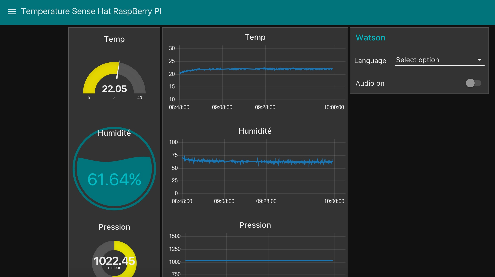

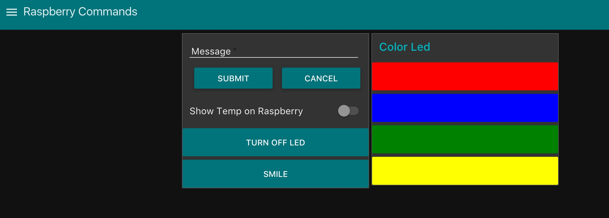

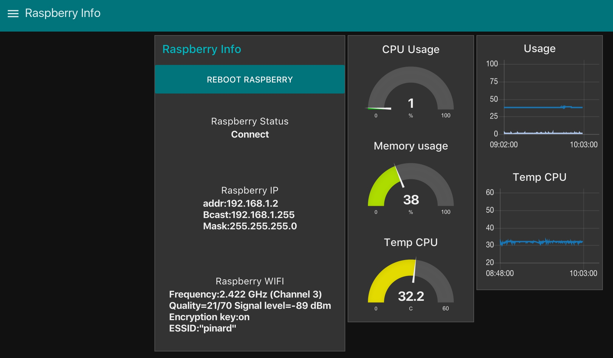

###### 3.4.2 Test your Rest API

1. access the 4 Rest API URL in your favorite browser 
```
http://<yourNodeRedInstance.mybluemix.net>/envData?
http://<yourNodeRedInstance.mybluemix.net>/tempsData?
http://<yourNodeRedInstance.mybluemix.net>/humidityData?
http://<yourNodeRedInstance.mybluemix.net>/raspData?
```

#### 4. iPhone application (Beta version)
1. Download xcode project
2. Open RaspSenseHat.xcworkspace in the RaspSenseHat folder
3. Build the project Ctlr-B
4. Run the project in the simulator for iPhone 7
5. go to setup to ch=hange the URL with your Node-Red Instance 
```
http://<yourNodeRedInstance.mybluemix.net>
```

 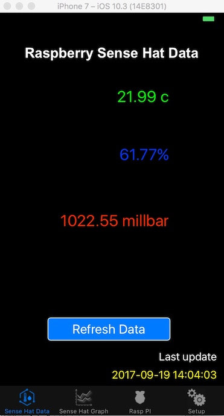 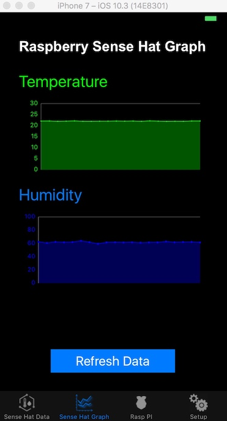 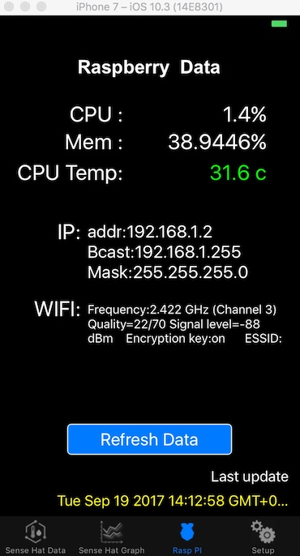
